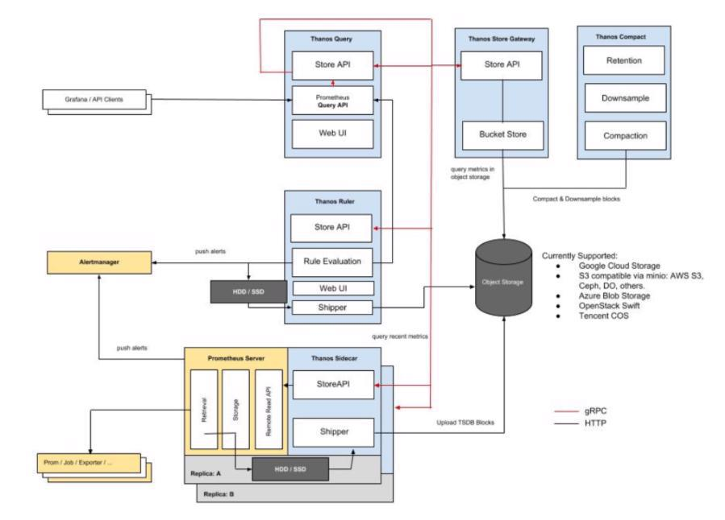
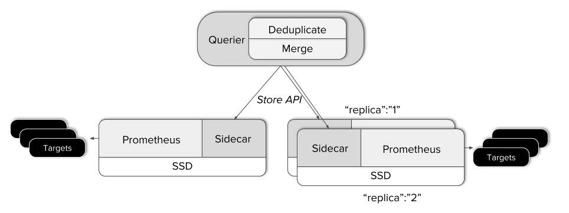
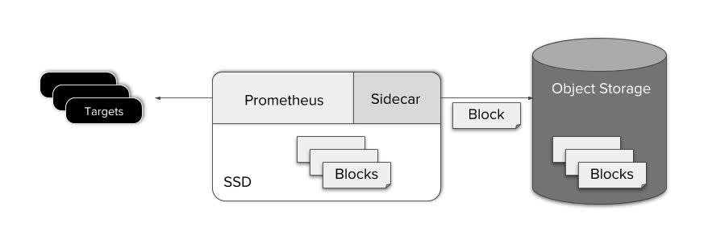
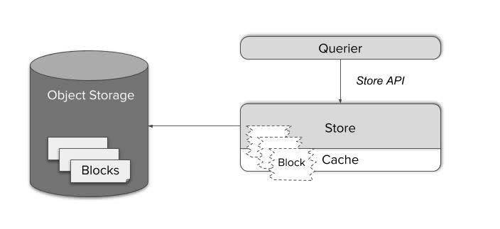
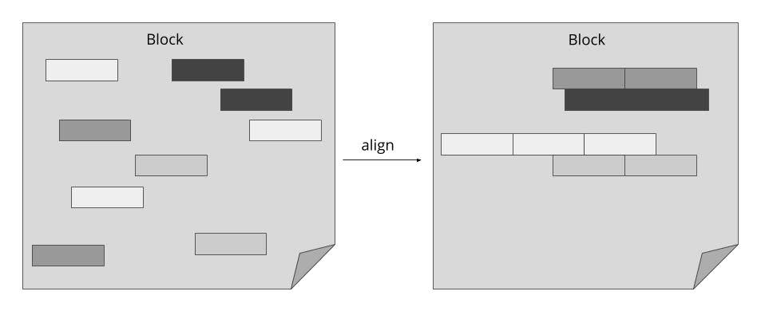
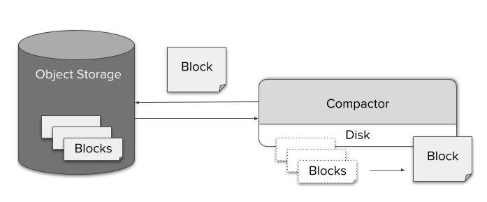
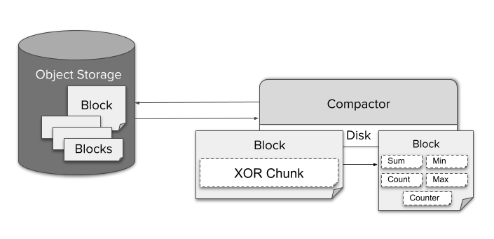
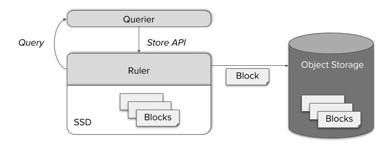

# Thanos Architecture



## Mô tả kiến trúc

### Global view

Khi kết nối tới lớp truy vấn thanos querier, các truy vấn được gửi tới các máy chủ prometheus. Thành phần `Sidecar` được triển khai cùng với mỗi máy chủ prometheus đang chạy. Nó hoạt động như 1 proxy cung cấp dữ liệu cục bộ của prometheus .



1. Khi querier nhận được yêu cầu, nó sẽ chuyển tới các máy chủ API store có liên quan, tức là Sidecar và tìm nạp dữ liệu time seri từ máy chủ prometheus. StoreAPI cũng có trên các thành phần như `Rulers`, `Store Gateways`.

2. Querier tổng hợp các phản hồi lại với nhau và đánh giá truy vấn PromQL dựa trên chúng. Nó có thể tổng hợp lại các dữ liệu rời rạc cũng như dữ liệu trùng lặp từ các máy chủ prometheus.

### Unlimited retention

Dữ liệu được lưu giữ ngoài thời gian lưu giữ thông thường của prometheus. Để làm điều này, một hệ thống lưu trữ bên ngoài được thiết lập để sao lưu dữ liệu được gọi là `object storage`

Công cụ lưu trữ của prometheus lưu giữ liệu vào disk khoảng 2 giờ 1 lần. Khi các blog data của prometheus xuất hiện, thanos tiến hành tải các khối mới vào trong `object storage`. 



Sao lưu dễ dàng và đối với việc truy vấn lại dữ liệu từ `object storage` như sau:

Thành phần thanos store hoạt động như 1 proxy truy xuất dữ liệu cho dữ liệu bên trong `object storage`. Cũng giống như thanos sidecars, nó tham gia vào nhóm `gossip` (hiểu nôm na là ngồi lê đôi mách) cũng được triển khai API store. Với cách này, các queriers có thể coi nó giống như sidecar - như 1 nguồn dữ liệu time seri data.



Store gateway xử lý định dạng dữ liệu của công cụ lưu trữ prometheus. Nó lập kế hoạch cho các truy vấn thông minh bằng cách lưu vào cache các phần chỉ mục cần thiết của các block, nó có thể giảm các truy vấn phức tạp xuống mức tối thiểu.



### Compaction & downsampling

Tại thời điểm các block dữ liệu được tải lên `object storage`, nó được coi là dữ liệu `historical (lịch sử)` và nó sẵn sàng để truy xuất thông qua Store gateway.  

Tuy nhiên, sau 1 thời gian, các block này tích tụ lại, để giải quyết vấn đề này, có 1 thành phần được gọi là `Compactor`. Nó chỉ áp dụng cơ chế nén cục bộ của prometheus cho dữ liệu trong `object storage` và có thể được chạy như 1 công việc định kỳ. 



Nhờ tính năng nén các sample hiệu quả của prometheus, việc truy vấn nhiều time seri trong 1 phạm vi dài không có vấn đề gì từ góc độ kích thước dữ liệu. Tuy nhiên việc giải nén các sample và chạy chúng thông qua xử lý truy vấn chắc chắn gây ra sự gia tăng đáng kể về độ trễ của truy vấn. Mặt khác, vì có hành



Để cso thể tạo ra dữ liệu rút gọn, `compactor` liên tục tổng hợp các sample xuống độ phân giải 5 phút và 1 giờ. Đối với các phân đoạn chunk, được mã hóa bằng nén XOR của TSDB, nó lưu trữ và tổng hợp các loại khác nhau, ví dụ: min, max, sum trong 1 block duy nhất. Điều này cho phép đối với 1 truy vấn PromQL nhất định, nó sẽ tự động chọn 1 tổng hợp thích hợp.

Vì chi phí dành cho lưu trữ trong bộ nhớ khá thấp, nên theo mặc định, Thanos luôn giữ nguyên cả độ phân giải thô, 5 phút và 1 giờ trong bộ nhớ mà không xóa độ phân giải thô. 

### Recording rules

Ngay cả với thanos, các record rule là 1 phần thiết yếu của giám sát. Chúng làm giảm độ phức tạp, độ trễ và thời gian của 1 truy vấn. Thuận tiện cho các chế độ xem tổng hợp quan trọng về dữ liệu metric. 



Thanos có 1 thành phần riêng biệt được goi là `Rule`. `Thanos rule` chịu trách nhiệm giám sát, nó là một công cụ hữu ích để đánh giá các cảnh báo, nó thực hiện đánh giá các metric dựa trên các rule và đưa ra cảnh báo gửi về alertmanager. Nó cũng có API store để `Querier` có thể truy cập các metric mới được đánh giá. Sau đó chúng cũng được sao lưu trong `object storage` và có thể truy cập thông qua `store gateway`.

## Các câu hỏi

### Cách thực thi truy vấn xảy ra trong thanos ?

Trong thanos, công cụ vanilla PromQL được sử dụng để đánh giá truy vấn để tìm ra time seri nào và phạm vi thời gian nào chúng ta cần để tìm nạp dữ liệu. Thanos sử dụng tính năng lọc cơ bản dựa trên phạm vi thời gian và label để lọc ra các StoreAPI sẽ không cung cấp cho nó dữ liệu mà nó mong muốn và sau đó gọi những dữ liệu còn lại.

Các kết quả sau đó được hợp nhất và nối lại với nhau theo thười gian từ các nguồn khác nhau. 

### Cách thanos xác định máy chủ API nào có dữ liệu mà nó cần trong một truy vấn ?

StoreAPI truyền bá các label và các phạm vi thời gian mà nó đang có dữ liệu. Vì vậy có thể thực hiện việc lọc cơ bản dựa vào những điều này. Ngoài ra có thể có một số kêt quả trùng lặp giữa các dữ liệu ở sidecar và các dữ liệu store data, điều này khó tránh.


### Liệu có vấn đề với nhiều sidecar cố gắng tải các block dữ liệu giống nhau lên object storage không ?

Có các lable duy nhất cho tất cả các phiên bản `Prometheus` `+` `sidecar` khác nhau. Để chỉ ra rằng tất cả các bản sao đang lưu trữ các mục tiêu giống nhau, chúng chỉ khác nhau ở 1 một nhãn. Ví dụ:

```
One:

"cluster": "prod1"
"replica": "0"
```
```
Two:

"cluster":"prod1"
"replica": "1"
```

Không có vấn đề với việc lưu trữ các metric có các nhãn trên vì các bộ nhãn là duy nhất. Querier có khả năng khử các trùng lặp metric bằng nhãn `replica` một cách nhanh chóng.


