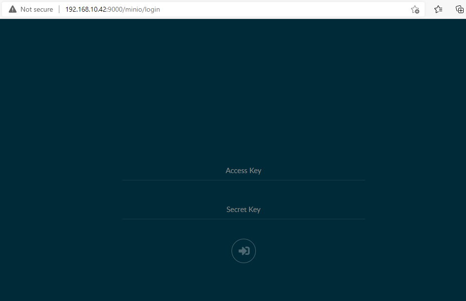

# Triển khai HA cho prometheus su dung thanos

**Các phụ thuộc:**

- *Phiên bản thấp nhất của Docker là 19.03*

- *Phiên bản thấp nhất của docker-compose là 1.28.0*

## Mô tả hệ thống

### 1. Sơ đồ triển khai


### Thông tin các node

*Đầu tiên, ta sẽ cần 1 cụm docker swarm gồm tối thiểu 2 node để có thể chạy*

- **Node 1 (Master)**

IP: 192.168.10.42  
OS: CentOS 7  
Hostname: prom_ha2  

- **Node2 (Slave)**

IP: 192.168.10.28  
OS: CentOS 7  
Hostname: prom_ha1  

- User root hoặc user có quyền sudo

## Cài đặt và cấu hình 

### Bước 1: Cấu hình căn bản cho các node

- Đặt hostname và tắt firewall cho các node: 

*node1:*

```
hostnamectl set-hostname prom_ha2
systemctl disable firewalld --now

sed -i 's/SELINUX=enforcing/SELINUX=disabled/g' /etc/sysconfig/selinux
sed -i 's/SELINUX=enforcing/SELINUX=disabled/g' /etc/selinux/config
setenforce 0
```

*node2:*

```
hostnamectl set-hostname prom_ha1
systemctl disable firewalld --now

sed -i 's/SELINUX=enforcing/SELINUX=disabled/g' /etc/sysconfig/selinux
sed -i 's/SELINUX=enforcing/SELINUX=disabled/g' /etc/selinux/config
setenforce 0
```

### Bước 2: Cài đặt docker và docker compose

*Thực hiện trên tất cả các node*

- Cài đặt docker: 

```
yum update -y
yum install -y yum-utils
yum-config-manager     --add-repo     https://download.docker.com/linux/centos/docker-ce.repo
yum install docker-ce docker-ce-cli containerd.io -y
```

-  Cài đặt docker-compose: 

```
curl -L "https://github.com/docker/compose/releases/download/1.29.2/docker-compose-$(uname -s)-$(uname -m)" -o /usr/local/bin/docker-compose

chmod +x /usr/local/bin/docker-compose
```

Sau đó kiểm tra lại với lệnh `docker-compose --version`:

```
docker-compose --version
```

### Bước 3: Thiết lập cụm docker swarm 

*Thực hiện trên node 1*

```
docker swarm init --advertise-addr 192.168.10.42
```

Sau đó ta sẽ được hướng dẫn follow theo command sau: 

```
docker swarm join --token SWMTKN-1-5zeitwslnuriokxxg71b2cea8ljbbc8yktrwec5w7xwgky6hkv-76v03h1ocawnfxkc2dlho2k24 192.168.10.42:2377
```

> Lưu ý: token trên chỉ app dụng được cho bài lab này!. Đối với lab khác thì token sẽ khác nhau. 

*Copy lệnh trên và thực hiện trên node 2*

```
root@prom_ha1:~# docker swarm join --token SWMTKN-1-5zeitwslnuriokxxg71b2cea8ljbbc8yktrwec5w7xwgky6hkv-76v03h1ocawnfxkc2dlho2k24 192.168.10.42:2377
This node joined a swarm as a worker.
```

### Bước 4: Clone repo thanos

*Thực hiện trên tất cả các node*

```
cd /opt
git clone https://github.com/hungviet99/quickstart-thanos.git
```

### Bước 5: Cài đặt thanos làm HA cho Prometheus

*Thực hiện trên node 1*

- Triển khai thanos 

```
cd /opt/quickstart-thanos
docker stack deploy -c docker-compose.yml thanos
```

- Kiểm tra lại các service 

```
[root@prom_ha2 ~]# docker service ls
ID             NAME                           MODE         REPLICAS   IMAGE                                       PORTS
ncawyc5urxfz   thanos_alertmanager            replicated   1/1        prom/alertmanager:v0.22.2                   *:9093->9093/tcp
tp68bf33pubw   thanos_cadvisor                replicated   1/1        gcr.io/google_containers/cadvisor:v0.36.0   *:8080->8080/tcp
bwnth38w2d6k   thanos_grafana                 replicated   1/1        grafana/grafana:8.0.5                       *:3000->3000/tcp
l6me4az42xo3   thanos_minio                   global       2/2        minio/minio:RELEASE.2020-05-01T22-19-14Z    *:9000->9000/tcp
pgkxcgafn85d   thanos_node-exporter           replicated   1/1        prom/node-exporter:v1.1.2                   *:9100->9100/tcp
i3c9g129h5l7   thanos_prometheus-1            replicated   1/1        prom/prometheus:v2.28.1                     *:9081->9090/tcp
q5jlg3as0r7k   thanos_prometheus-2            replicated   1/1        prom/prometheus:v2.28.1                     *:9082->9090/tcp
phvu3tzl4bhe   thanos_thanos-bucket-web       global       2/2        quay.io/thanos/thanos:v0.21.1               *:10904->10902/tcp
p32yur3t3o1n   thanos_thanos-compactor        global       2/2        quay.io/thanos/thanos:v0.21.1
ibknjapdj2bw   thanos_thanos-querier          global       2/2        quay.io/thanos/thanos:v0.21.1               *:10902->10902/tcp
u15dpfoj09js   thanos_thanos-query-frontend   global       2/2        quay.io/thanos/thanos:v0.21.1               *:10901->10901/tcp
99f5vb4dxytw   thanos_thanos-ruler            global       2/2        quay.io/thanos/thanos:v0.21.1               *:10903->10902/tcp
vxqqs97dh53g   thanos_thanos-sidecar-1        replicated   1/1        quay.io/thanos/thanos:v0.21.1
phvny4iswew1   thanos_thanos-sidecar-2        replicated   1/1        quay.io/thanos/thanos:v0.21.1
qtsulazhu8j3   thanos_thanos-store-gateway    global       2/2        quay.io/thanos/thanos:v0.21.1
```

Khi các service đã lên hết tức là đã cài thành công

### Bước 6: Kiểm tra các dịch vụ đang chạy 

- Thanos querier-frontend


- Thanos rules


- Minio



- Alert manager


- Grafana


