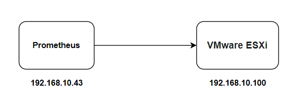
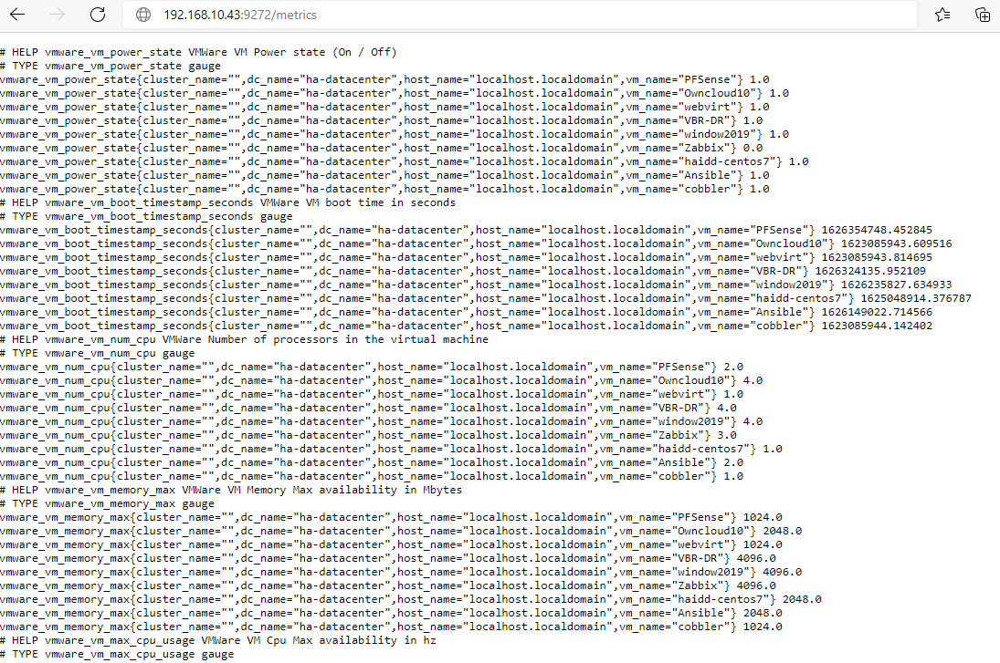

# Cài đặt VMware exporter 

## Mô hình cài đặt



VMware exporter sử dụng tài khoản quản lý của vmware để truy cập sau đó thực hiện  lấy số liệu trên vmware rồi xuất thành các metric. Vậy nên ta chỉ cần triển khai vmware ở 1 node trong mạng và cung cấp cho nó tài khoản để truy cập vmware, nó sẽ giám sát và đưa ra các metric. Ở đây mình cài đặt luôn vmware exporter trên cùng 1 node với prometheus để tiện cho việc quản lý.

## Cài đặt vmware exporter

Tiến hành cài VMware trên cùng node với prometheus:

```
docker run -d  \
-p 9272:9272 \
--restart always \
-e VSPHERE_USER=root \
-e VSPHERE_PASSWORD=AHDKIrjfod395@34 \
-e VSPHERE_HOST=192.168.10.100 \
-e VSPHERE_IGNORE_SSL=True \
-e VSPHERE_SPECS_SIZE=2000 \
--name vmware_exporter \
pryorda/vmware_exporter
```

> - `VSPHERE_USER` : Khai báo user để truy cập vmare esxi
> - `VSPHERE_PASSWORD` : Khai báo Password tương ứng với user trên
> - `VSPHERE_HOST` : Địa chỉ của Vmware esxi

- Sau khi cài đặt, kiểm tra xem vmware đã hoạt động hay chưa: 



Khi vmware exporter đã lấy được các metric, tiến hành cấu hình trong prometheus. Thêm 1 job dành cho vmware vào file cấu hình của prometheus như sau: 

```
  - job_name: 'vmware_esx'
    metrics_path: '/metrics'
    static_configs:
      - targets:
        - 192.168.10.100
    relabel_configs:
      - source_labels: [__address__]
        target_label: __param_target
      - source_labels: [__param_target]
        target_label: instance
      - target_label: __address__
        replacement: 192.168.10.43:9272
```

- Reload lại cấu hình của prometheus

```
docker exec -it -u 0 prometheus killall -HUP prometheus
```

