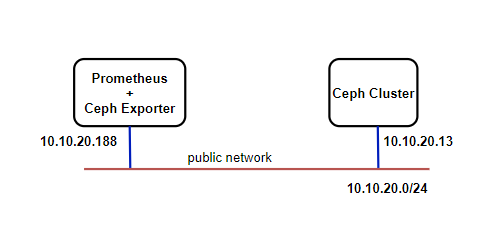
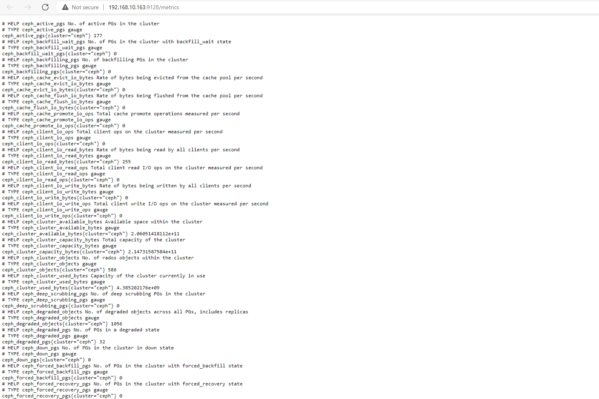

# Cài đặt ceph exporter monitor ceph

## Mô hình cài đặt



Ceph exporter được cài trên cùng node với prometheus server. Dải `public network` không phải dải mạng ra ngoài internet mà dải `public network` là dải mạng được cấu hình trong tham số **public network** ở file `ceph.conf`.

### Tạo file cấu hình

*Thực hiện trên ceph exporter*

Tạo thư mục config ceph trên ceph exporter:

```
mkdir /etc/ceph
```

*Thực hiện trên Ceph cluster*

- Copy file cấu hình ceph sang ceph exporter

```
scp /etc/ceph/ceph.conf root@10.10.20.188:/etc/ceph/
```

- Copy file cấu hình admin keyring sang ceph exporter

```
scp /etc/ceph/ceph.client.admin.keyring root@10.10.20.188:/etc/ceph/
```

*Thực hiện trên ceph exporter*

Kiểm tra file cấu hình ceph đã được copy sang hay chưa

```
root@prometheus-srv:~# ls -alh /etc/ceph
total 20K
drwxr-xr-x   2 root root 4.0K Aug 17 03:54 .
drwxr-xr-x 105 root root 4.0K Aug 17 03:49 ..
-rw-r--r--   1 root root  186 Aug 16 10:32 ceph.client.admin.keyring
-rw-r--r--   1 root root 1.4K Aug 17 03:54 ceph.conf
```

Sau khi đã có file config, tiến hành cài đặt ceph exporter

## Cài đặt ceph exporter

*Thực hiện trên ceph exporter*

Tiến hành cài ceph exporter trên cùng node với prometheus:

```
docker run -itd --name ceph_exporter \
-v /etc/ceph:/etc/ceph \
--restart always \
--net host \
digitalocean/ceph_exporter
```
- Sau khi cài đặt, kiểm tra xem ceph exporter đã hoạt động hay chưa. Truy cập `http://192.168.10.43:9128`



Khi ceph exporter đã lấy được các metric, tiến hành cấu hình trong prometheus. Thêm 1 job dành cho ceph vào file cấu hình của prometheus như sau: 

```
  - job_name: 'ceph_lab'
    scrape_interval: 15s
    static_configs:
      - targets: ['192.168.10.163:9128']
```

- Reload lại cấu hình của prometheus

```
docker exec -it -u 0 prometheus killall -HUP prometheus
```