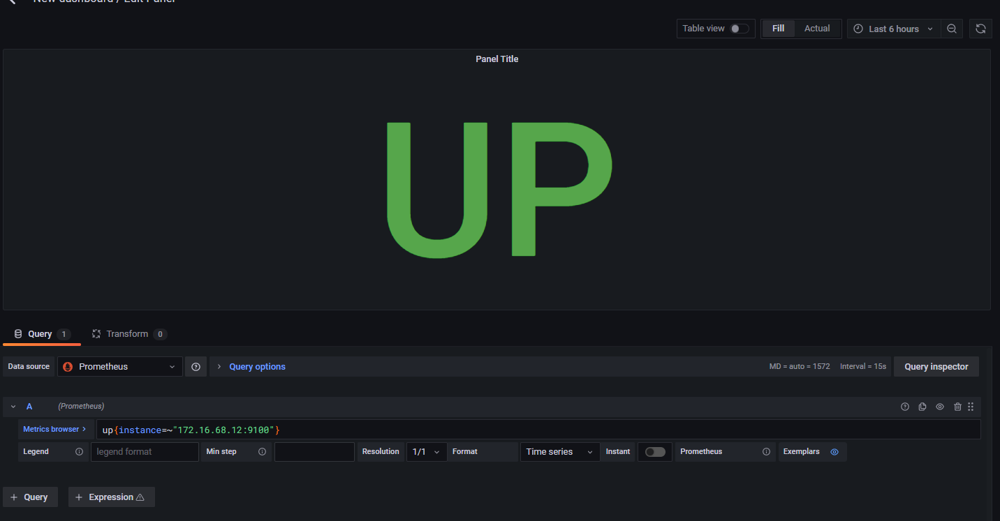

# Hướng dẫn vẽ dashboard trên Grafana

Sau khi grafana đã được add source đữ liệu là Prometheus, ta tiến hành vẽ doashboard cho prometheus.

Mình sẽ thử vẽ dashboard cho metric của `node exporter` với các bước như sau:

- Tạo 1 dashboard mới

- Chọn add panel để thêm 1 panel

- Sau đó chọn Add an empty panel

### 1. Tạo dashboard Stat

Đầu tiên mình sử dụng metric là `up` để phát hiện ra các node đang bật:

Với dạng metric này, mình sẽ sử dụng dạng biểu đồ là `Stat` vì chỉ cần hiển thị giá trị của metric mà không sử dụng biểu đồ dạng graph:

Vì trong hệ thống có nhiều node nên có thể nó sẽ hiển thị nhiều giá trị trên 1 panel, để chỉ hiển thị giá trị metric của 1 node mong muốn, ta có thể chỉ định thẳng node đó trên metric:

Trong trường hợp này, metric có 2 trạng thái là `1` và `0` tương đương với `up` và `down`. Ta chọn `Stat styles` với các mục như sau:

- `Color mode` để hiển thị màu trên giá trị, có thể chọn màu cho background hoặc chỉ đặt màu cho Value hoặc chế độ None để không đặt màu gì.
- `Graph mode` không đặt gì để chỉ hiển thị value thôi.
- `Text alignment` Đặt `Center` để đặt giá trị ở chính giữa.

Tiếp theo tới mục `Thresholds` để chỉnh màu cho Value:

Mình chọn màu đỏ cho value là 0 và xanh cho value là 1. 

Ở mục `Value mappings`, chọn Add value mappings để thay thế cho value 0 và 1.

Chọn `Add a new mapping` và chọn `Value`

Nhập `Value` là 1 sẽ map với `UP`

Tương tự như vậy 0 sẽ map với `DOWN`

Sau khi xong ta sẽ có biểu đồ như sau:

Với các biểu đồ dạng chỉ cần hiển thị Value ở thời điểm hiện tại mà không cần quan tâm các value ở các mốc thời gian khác nhau, ta nên sử dụng `Stat` để vẽ biểu đồ.

### 2. Tạo dashboard Gauge

Dashboard gauge nên sử dụng trong các trường hợp để trực quan một giá trị có thể lặp lại trong 1 khoảng đo. Có thể sử dụng nó để hiển thị % sử dụng ram, CPU, ...

Ví dụ, để tính % sử dụng của swap memory, ta lấy giá trị tính được của metric chia cho 100.

Tại mục `Standard options` chọn Unit là `Percent (0-100)` để dữ liệu hiển thị dưới dạng phần trăm.

Sau khi tạo xong ta sẽ có được dashboard cho swap memory như sau:

### 3. Tạo dashboard Graph

Dashboard graph sử dụng để hiển thị các chỉ số dưới dạng line. Loại biểu đồ này phù hợp để hiển thị giá trị theo mốc thời gian. Ví dụ để hiển thị biểu đồ network traffic ta sẽ dùng loại biểu đồ này vì nó có thể biểu diễn được các mốc thời gian traffic lên xuống trong mạng. 

Các loại này thường sử dụng `rate`, ví dụ như trong hình trên sẽ trả về dung lượng của `network receiver` và `network transmit` được đo trong 5 phút qua, trên mỗi time seri.

Rate chỉ phù hợp với các loại metric type là counter.

### 4. Tạo dashboard Table

Dashboard table hỗ trợ nhiều chế độ cho các time seri. Table thường sử dụng để kết hợp nhiều query thành 1 bảng với mục đích thống kê dữ liệu.

Như hình trên, table được tổng hợp từ nhiều query với mục đích ghép dữ liệu từ các query khác nhau vào cùng 1 bảng với mục đích thống kê dữ liệu.

Các cột trong table và dữ liệu trong cột được tùy chỉnh trong mục `Colume Styles`. Có thể tùy chỉnh loại dữ liệu cho giá trị trong cột, hoặc tùy chọn có hiển thị cột đó trong bảng hay không, cũng có thể thay thế giá trị trên cột trong bảng bằng 1 giá trị nào đó ...

Vì dữ liệu trên table chỉ hiển thị các giá trị tại thời điểm hiện tại nên là ta nên sử dụng table cho các metric grauge thôi.

